# Explaining Play-style Behaviours with Hierarchical Policies and Shapley Values

---

## Table of Contents
- [Recourses](#recourses)
- [MiniDungeons](#minidungeons)
  - [Domain Details](#domain-details)
    - [Observation Space](#observation-space)
    - [Action Space](#action-space)
    - [Play-style Behaviours](#play-style-behaviours)
  - [Experimentation Details](#experimentation-details)
    - [Feature Grouping](#feature-grouping)
    - [Hardware and Software Details](#hardware-and-software-details)
    - [Training Details](#training-details)
  - [Results](#results)
- [Settlers of Catan](#settlers-of-catan)
  - [Domain Details](#domain-details-1)
    - [Observation Space](#observation-space-1)
    - [Cube Coordinates for Hexagonal Grids](#cube-coordinates-for-hexagonal-grids)
    - [Action Space](#action-space-1)
    - [Play-style Behaviours](#play-style-behaviours-1)
  - [Experimentation Details](#experimentation-details-1)
    - [Feature Groups](#feature-groups)
  - [Hardware and Software Details](#hardware-and-software-details-1)
  - [Training Details](#training-details-1)
  - [Results](#results-1)
- [Other](#other)
  - [MSEv Evaluation Criterion](#msev-evaluation-criterion)
- [References](#references)

---
## Recourses 
- [groupShapley framework](https://github.com/NorskRegnesentral/shapr)
- [MiniDungeons Gym](https://github.com/ganyariya/gym-md)
- [Catanatron](https://github.com/bcollazo/catanatron)

## MiniDungeons

### Domain Details

#### Observation Space


<p align="center">
  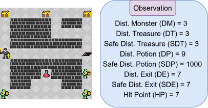
  <br><em>Figure: Example of a state observation in MiniDungeons.</em>
</p>

The observation space in MiniDungeons provides goal-oriented information that facilitates high-level decision-making. Distances between the agent and relevant objects are precomputed using the A* algorithm, abstracting away low-level spatial reasoning and allowing the agent to focus on strategic planning.

Each object type (e.g., treasures, potions, exits) is represented by two distances:
- **Safe distance**: the shortest path avoiding monsters
- **Unsafe distance**: the shortest path regardless of danger

Monsters are treated as threats and only their direct (unsafe) distances are reported. Objects that are unreachable or absent in a level have their distance feature set to `1000`. For example, in the figure above, the potion is not safely reachable, so the safe distance to the potion is assigned the value `1000`.

**Naming convention:** Acronyms are used for observation features throughout. For example, Safe Distance to Treasure → `SDT`, Unsafe Distance to Potion → `DP`.

#### Action Space

MiniDungeons uses a **high-level action space** that abstracts away low-level movement decisions. Rather than selecting primitive moves (`up`, `down`, `left`, `right`), the agent chooses a target object or destination to approach or interact with (e.g., a treasure, an enemy, or an exit).

Once a target is selected, the environment computes an optimal path from the agent's current position using A*. The agent then follows this path one step per environment tick.

#### Play-style Behaviours

#### Play-style Behaviours

Play-style policies represent various player behaviours commonly found in dungeon crawler-type games, generated via reward shaping:

<table>
  <thead>
    <tr><th>Play-style</th><th>Description</th></tr>
  </thead>
  <tbody>
    <tr><td><strong>Exit</strong></td><td>Gets to the level's exit in as few steps as possible</td></tr>
    <tr><td><strong>Killer</strong></td><td>Defeats all monsters in the level before exiting</td></tr>
    <tr><td><strong>Treasure</strong></td><td>Collects all treasure items before exiting</td></tr>
    <tr><td><strong>Potion</strong></td><td>Keeps health points high by collecting all potions before exiting</td></tr>
  </tbody>
</table>

**Reward shaping table:**
<p align="center">
  <br><em>Table showing the reward shaping used to create the Play-style behaviours used in MiniDungeons.</em>
</p>
<table>
    <tr>
        <td></td>
        <td colspan="4"> Play-Style Behaviour Rewards</td>
    </tr>
    <tr>
        <td>Reward Type</td>
        <td>Killer</td>
        <td>Treasure</td>
        <td>Potion</td>
        <td>Exit</td>
    </tr>
    <tr>
        <td>Turn(step)</td>
        <td>-1</td>
        <td>-1</td>
        <td>-1</td>
        <td>-1</td>
    </tr>
    <tr>
        <td>Exit</td>
        <td>10</td>
        <td>10</td>
        <td>10</td>
        <td>50</td>
    </tr>
    <tr>
        <td>Kill Monster</td>
        <td>50</td>
        <td>0</td>
        <td>0</td>
        <td>0</td>
    </tr>
    <tr>
        <td>Treasure</td>
        <td>0</td>
        <td>50</td>
        <td>0</td>
        <td>0</td>
    </tr>
    <tr>
        <td>Potion</td>
        <td>0</td>
        <td>0</td>
        <td>50</td>
        <td>0</td>
    </tr>
    <tr>
        <td>Dead</td>
        <td>-250</td>
        <td>-250</td>
        <td>-250</td>
        <td>-250</td>
    </tr>
</table>
MiniDungeons offers a simplified, high-level action and observation space, along with the ability to easily generate play-style behaviours that directly correspond to game features. This environment is particularly valuable for our research as it enables a direct comparison of performance and accuracy between traditional Shapley values (Lundberg & Lee, 2017) and groupShapley values (Jullum et al., 2021). Furthermore, the close correlation between play-style behaviours and state features facilitates the quantification and comparative analysis of explanations generated by these two methods.


---

### Experimentation Details


#### Feature Grouping

Features were grouped to represent the different play-style behaviours the switching agent utilises. Safe and unsafe distance features are grouped together as both refer to the same object and are strongly dependent. HP is grouped with the potion features since a player collects potions to increase health.

<p align="center">
  
  <br><em>Figure: Feature groups in MiniDungeons, aligned with the generated play-style behaviours. The monster feature group (green) aligns with the Killer play-style. The treasure feature group (yellow) aligns with the Treasure play-style. The health feature group (red) aligns with the Potion play-style. The exit feature group (blue) aligns with the Exit play-style.</em>
</p>

#### Hardware and Software Details

The table below contains all the hardware specifications used as well as package versions of the main libraries used during experimentation.
<p align="center"><em>Computer Hardware Specifications and Package Versions Used Training & Experiments</em></p>
<table align="center">
  <thead>
    <tr><th>Component</th><th>Specification</th></tr>
  </thead>
  <tbody>
    <tr><td>CPU</td><td>Intel(R) Core(TM) i9-10940X CPU @ 3.30GHz</td></tr>
    <tr><td>GPU</td><td>GeForce RTX 3090 24GB</td></tr>
    <tr><td>RAM</td><td>125 GB</td></tr>
    <tr><td>CUDA Version</td><td>12.1</td></tr>
    <tr><td>PyTorch Version</td><td>2.3.1</td></tr>
    <tr><td>Stable-baselines3</td><td>2.3.2</td></tr>
    <tr><td>Shapr (groupShapley Framework)</td><td>1.0.0</td></tr>
    <tr><td>SHAP framework</td><td>0.46.0</td></tr>
  </tbody>
</table>


#### Training Details

The table below contains the PPO hyperparameters used for training. The same hyperparameters were used to train both the base policies as well as the switching agent.
<p align="center"><em>Custom PPO Hyperparameters for Stable-Baselines3</em></p>
<table align="center">
  <thead>
    <tr><th>Hyperparameter</th><th>Value</th><th>Description</th></tr>
  </thead>
  <tbody>
    <tr><td><code>policy</code></td><td>MlpPolicy</td><td>Type of policy architecture</td></tr>
    <tr><td><code>learning_rate</code></td><td>1e-3</td><td>Learning rate</td></tr>
    <tr><td><code>n_steps</code></td><td>2048</td><td>Steps per update</td></tr>
    <tr><td><code>batch_size</code></td><td>64</td><td>Minibatch size</td></tr>
    <tr><td><code>n_epochs</code></td><td>10</td><td>Epochs per update</td></tr>
    <tr><td><code>gamma</code></td><td>0.99</td><td>Discount factor</td></tr>
    <tr><td><code>gae_lambda</code></td><td>0.95</td><td>GAE lambda</td></tr>
    <tr><td><code>clip_range</code></td><td>0.2</td><td>PPO clipping parameter</td></tr>
    <tr><td><code>clip_range_vf</code></td><td>null</td><td>Value function clip (disabled)</td></tr>
    <tr><td><code>ent_coef</code></td><td>0.0</td><td>Entropy coefficient</td></tr>
    <tr><td><code>vf_coef</code></td><td>0.5</td><td>Value function coefficient</td></tr>
    <tr><td><code>max_grad_norm</code></td><td>0.5</td><td>Gradient norm clip</td></tr>
    <tr><td><code>use_sde</code></td><td>false</td><td>State-dependent exploration</td></tr>
    <tr><td><code>sde_sample_freq</code></td><td>-1</td><td>SDE sample frequency</td></tr>
    <tr><td><code>target_kl</code></td><td>null</td><td>Target KL divergence (not used)</td></tr>
    <tr><td><code>tensorboard_log</code></td><td>null</td><td>Tensorboard log path</td></tr>
    <tr><td><code>create_eval_env</code></td><td>false</td><td>Create separate eval environment</td></tr>
    <tr><td><code>verbose</code></td><td>1</td><td>Verbosity level</td></tr>
    <tr><td><code>seed</code></td><td>42</td><td>Random seed</td></tr>
    <tr><td><code>device</code></td><td>cuda</td><td>Device</td></tr>
    <tr><td><code>_init_setup_model</code></td><td>true</td><td>Initialize model on creation</td></tr>
    <tr><td><code>total_timesteps</code></td><td>1e6</td><td>Total timesteps</td></tr>
  </tbody>
</table>


The table below shows the rewards used for training the switching agent. All object/destination rewards were given the same reward value, such that the switching does not favor one play-style over others.
<p align="center"><em>Table showing the rewards used to train the Switching Agent</em></p>
<table align="center">
  <thead>
    <tr><th>Reward Type</th><th>Reward value</th></tr>
  </thead>
  <tbody>
    <tr><td>Turn (step)</td><td>-1</td></tr>
    <tr><td>Exit</td><td>50</td></tr>
    <tr><td>Kill Monster</td><td>50</td></tr>
    <tr><td>Treasure</td><td>50</td></tr>
    <tr><td>Potion</td><td>50</td></tr>
    <tr><td>Dead</td><td>-250</td></tr>
  </tbody>
</table>


---

### Results

Here, we present all ridgeline plots, including the ones that were not present in the main text.

#### Traditional Shapley Values

<p align="center">
  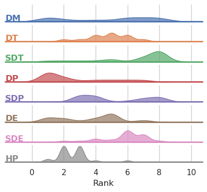
  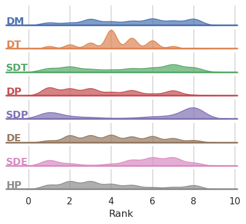
  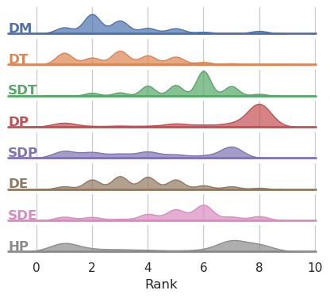
  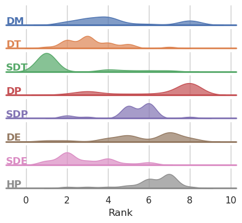
  <br><em>(a) Treasure Actions &nbsp;&nbsp; (b) Monster Actions &nbsp;&nbsp; (c) Potion Actions &nbsp;&nbsp; (d) Exit Actions</em>
  <br><br><em>Ridgeline graphs for Traditional Shapley values. Each row maps the number of times a feature is assigned a particular rank in every state. Since rank is associated with importance, each row is each feature's distribution of importance. Peaks correspond to that feature having high occurrence of being that rank.</em>
</p>

#### groupShapley Values (No Groups)

<p align="center">
  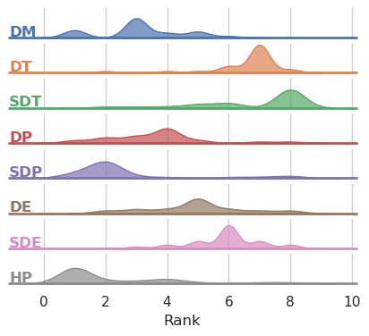
  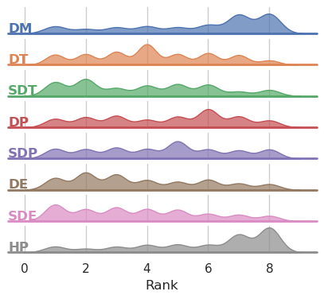
  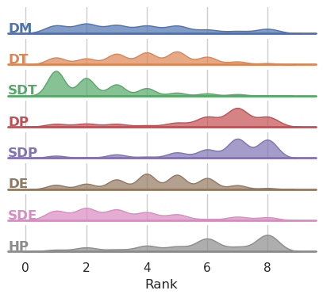
  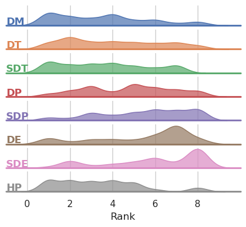
  <br><em>(a) Treasure Actions &nbsp;&nbsp; (b) Monster Actions &nbsp;&nbsp; (c) Potion Actions &nbsp;&nbsp; (d) Exit Actions</em>
  <br><br><em>Ridgeline Plot for groupShapley values without any groups. In sub-figure (a) features DT and SDT get assigned larger ranking values resulting in a rightward skew indicating that those features were the most important features when deciding to use the treasure play-style. In sub-figure (b) we see that DM and HP are regularly the highest ranked features, indicating their importance in the agent deciding to employ the killer play-style. Furthermore, when deciding to play the potion play-style (sub-figure (c)) DP, SDP and HP are regularly the highest rank features. These three sub-figures illustrate that groupShapley correctly aligns features to their corresponding play-style behaviours.</em>
</p>

#### groupShapley Values (With Grouped Features)

<p align="center">
  
  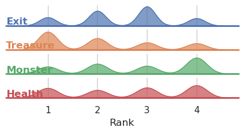
  
  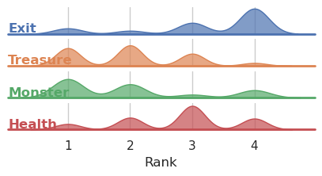
  <br><em>(a) Treasure Actions &nbsp;&nbsp; (b) Monster Actions &nbsp;&nbsp; (c) Potion Actions &nbsp;&nbsp; (d) Exit Actions</em>
  <br><br><em>Ridgeline graphs for groupShapley values with grouped features. Sub-figure (a) demonstrates that the treasure feature group is regularly the most important feature group when deciding to play the treasure play-style behaviour. Sub-figure (b) shows that the Monster Feature group is regularly the most important feature in deciding to employ the killer play-style. The desired results are also demonstrated in sub-figure (c). Finally, incorporating feature groups we get the desired result for the exit actions in sub-figure (d).</em>
</p>

---

## Settlers of Catan

<p align="center">
  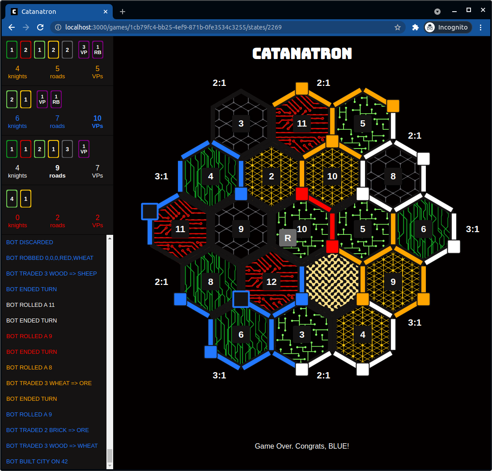
  <br><em>Catanatron</em>
</p>

Settlers of Catan is a strategy board game where players collect and trade resources to build settlements, roads, and cities, aiming to accumulate 10 victory points before their opponents to win the game. Players roll dice to collect resources such as lumber, brick, ore, grain, and wool, which they use to build settlements, roads, and cities. They can also trade resources with each other or with the bank to acquire the resources they need. The actions in the game include placing settlements, roads, and cities, rolling dice, collecting resources, trading with other players or the bank, and buying/playing development cards. The observations in the game include the resources available on the board, the numbers rolled on the dice, the structures built by each player, and the development cards acquired.

We use Catanaron's implementation of Settlers of Catan as this implementation allows for simple integration of generated play-styles. Furthermore, Settlers of Catan is a widely known game and this domain has a large complex state and action space, but qualitative results will be easily interpretable. Furthermore, due to the large complex feature state space we can perform experiments that focus on, and explore the use of groupShapley values in real world complex domains.

### Domain Details

#### Observation Space

<p align="center">
  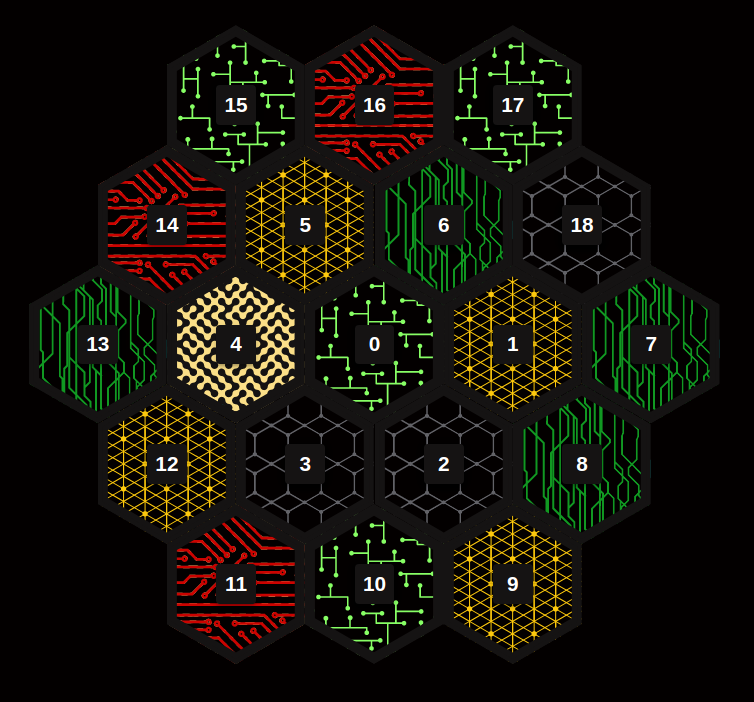
  &nbsp;&nbsp;&nbsp;
  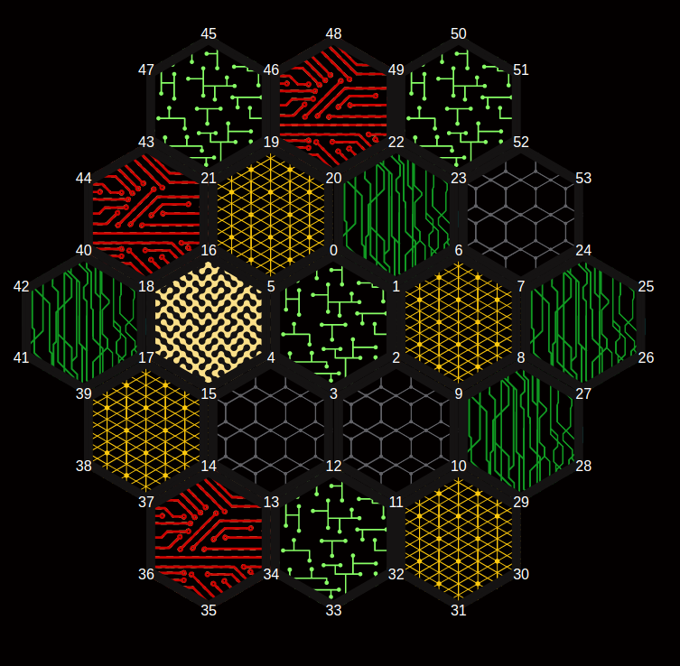
  <br><em>(a) Tile-ids &nbsp;&nbsp;&nbsp;&nbsp;&nbsp;&nbsp;&nbsp;&nbsp;&nbsp;&nbsp;&nbsp;&nbsp;&nbsp;&nbsp;&nbsp;&nbsp;&nbsp;&nbsp;&nbsp;&nbsp;&nbsp;&nbsp;&nbsp;&nbsp;&nbsp;&nbsp;&nbsp;&nbsp;&nbsp;&nbsp;&nbsp;&nbsp;&nbsp;&nbsp;&nbsp;&nbsp;&nbsp;&nbsp;&nbsp;&nbsp;&nbsp;&nbsp;&nbsp; (b) Node-ids</em>
  <br><br><em>Catanatron Tiles and nodes. Each tile corresponds to a particular resource. The light green tiles (e.g. Tile-id 15) represents the sheep resource. Dark green tiles (e.g. Tile-id 6) represent wood. Red tiles (e.g. Tile-id 16) represent brick. The dark yellow tiles (e.g. Tile-id 5) represent wheat. Finally, the single light yellow tile (e.g. Tile-id 4) represents the desert tile.</em>
</p>

The observation space is represented using a numeric feature vector. See the [Observation Space documentation](https://catanatron.readthedocs.io/en/latest/catanatron.gym.envs.html#id2) for further details. They appear in vector in alphabetical order, from the perspective of the "current" player (hiding/showing information accordingly). P0 is the "current" player. P1 is next in line.

The size of the observation space scales with the number of players. The number of features is determined using:

```
n_features = 194 × N + 226
```

As such, if there are two players there are 614 individual features.

The following nomenclature is used for Tile-ids and Node-ids, which represent the resource tile types and possible settlement/city placement locations respectively. Edge-ids, which represent possible road locations, are self-describing (Node-id, Node-id) tuples. Cube coordinates are used for tiles.

Due to the large complex observation space naming conventions had to be used for particular words and features. P0 means the "current" player and in our case is always the switching agent. P1 is the enemy/opposing player. VP or VPS mean Victory Points. Lastly, Dev Cards means Development cards.

#### Cube Coordinates for Hexagonal Grids

<p align="center">
  
  <br><em>Image of a Hexagonal Grid using Cube Coordinates.</em>
</p>

Cube coordinates can be used to represent positions on a hexagonal grid, as seen in the figure above. Unlike square grids that use two axes, hexagonal grids, with their three directions, benefit from a three-axis system. This system is known as cube coordinates. In this system, each hexagon is assigned three coordinates (q, r, s), and the sum of these coordinates must equal zero (q + r + s = 0). This ensures that each hexagon has a unique and consistent coordinate representation. Essentially, by embedding the hexagonal grid within a 3D space, calculations are simplified, especially when determining distances between hexagons. This system makes performing operations like finding neighboring hexagons and calculating distances, which can be complex in other hexagonal grid coordinate systems, simpler.

#### Action Space

The action space in this domain uses action masking, providing the agent with a dynamic list of valid actions based on the current state. These actions available to the agent can range from building roads/settlement/cities to rolling the dice or ending its turn. This list of available actions is guaranteed to be non-empty, as the 'end turn' action is always available. Actions are represented as integers within the range [0, 289], where each integer corresponds to a tuple composed of enums and primitive data types. For example:

- Action 227 is `(ActionType.PLAY_MONOPOLY, WHEAT)` (i.e. play monopoly card and select wheat)
- Action 96 is `(ActionType.BUILD_SETTLEMENT, 3)` (i.e. build settlement on node 3)
- Action 4 is `(ActionType.MOVE_ROBBER, (-1,0,1), Color.BLUE)` (i.e. move robber to tile on coordinate (-1,0,1) and steal from blue)
- Action 289 is `(ActionType.END_TURN, None)` (i.e. do nothing else and end turn)

#### Play-style Behaviours

In the Settlers of Catan domain, the play-style policies will represent player strategies commonly used in the game. For example, one strategy commonly found in the game is to use your resources to draw as many development cards as possible as fast as possible. Due to the complexity of the environment, all play-style policies are handcrafted and utilise the concept of weighting actions based on a particular behaviour. For example, when wanting to mimic a player that wishes to build as many cities as possible, all the actions that have the type `BUILD_CITY` will have higher weighting than all the other actions. The final action is then chosen at random (pseudo random number generator) using these adjusted weightings. Using this method to mimic play-style behaviours is suitable for our research as our objective is not to learn an optimal policy but rather to explain the action selection. The player behaviours created, using the action weightings shown in the table below, are as follows:

- **City Player**: Actions related to building cities are weighted the highest.
- **Settlement Player**: Actions related to building settlements are weighted the highest.
- **Longest Road Player**: Actions related to building a road in order to get the longest road card and maintaining the longest road are weighted the highest.
- **Dev Card Player**: Actions related to collecting development cards are weighted the highest.
- **Do Nothing Player**: Actions related to ending their turn are weighted the highest.
<p align="center"><em>Action weighting used to generate the play-style behaviours discussed.</em></p>
<table align="center">
  <thead>
    <tr>
      <th>Action type</th>
      <th>City</th>
      <th>Settlement</th>
      <th>Longest Road</th>
      <th>Dev Card</th>
    </tr>
  </thead>
  <tbody>
    <tr><td>Build City</td><td>10000</td><td>1</td><td>1</td><td>1</td></tr>
    <tr><td>Build Settlement</td><td>1</td><td>10000</td><td>1</td><td>1</td></tr>
    <tr><td>Build Road</td><td>1</td><td>1</td><td>10000</td><td>0</td></tr>
    <tr><td>Buy Development Card</td><td>0</td><td>0</td><td>1</td><td>10000</td></tr>
    <tr><td>Play Knight Card</td><td>0</td><td>0</td><td>1</td><td>1000</td></tr>
    <tr><td>Play Road Card</td><td>0</td><td>0</td><td>1000</td><td>1</td></tr>
  </tbody>
</table>


In the table below, we show that the constructed play-style behaviours mimic their intended play-styles-centric behaviours and none of the behaviours are dominant. None of the behaviours being dominant means that during training our switching agent we minimise the possibility of the switching agent favouring a single play-style behaviour during training. Avg VP, Avg Settlements, Avg Cities and Avg Dev VP represents the average number of pieces built or victory points (VP) collected in a game. For instance, The City player on average places more cities than any other player with an average of 1.77 cities per game. Avg Road and Avg Army represent how often the behaviours achieved the longest road and the largest army respectively. For example, the Longest Road player builds the longest road in 38% of games.

The Do Nothing player was not included in the table below as this play-style behaviour is not one that is focused on in the research. The Do Nothing Player is only used so that the switching agent has an option to not do anything in its turn, this allows the switching agent to collect more resources and prevent it from constantly building game objects.
<p align="center"><em>Statistics of the base player behaviours over 100 games to illustrate that the generated play-style behaviours perform as intended to mimic the desired behaviours.</em></p>
<table align="center">
  <thead>
    <tr>
      <th></th>
      <th>Wins</th>
      <th>Avg VP</th>
      <th>Avg Settlements</th>
      <th>Avg Cities</th>
      <th>Avg Road</th>
      <th>Avg Army</th>
      <th>Avg Dev VP</th>
    </tr>
  </thead>
  <tbody>
    <tr><td>City Player</td><td>27</td><td>5.72</td><td>1.68</td><td><strong>1.77</strong></td><td>0.25</td><td>0.00</td><td>0.00</td></tr>
    <tr><td>Settlement Player</td><td>25</td><td>5.95</td><td><strong>2.80</strong></td><td>1.35</td><td>0.23</td><td>0.00</td><td>0.00</td></tr>
    <tr><td>Longest Road Player</td><td>23</td><td>5.88</td><td>2.58</td><td>0.35</td><td><strong>0.38</strong></td><td>0.35</td><td>1.15</td></tr>
    <tr><td>Dev Card Player</td><td>25</td><td>6.22</td><td>1.93</td><td>0.70</td><td>0.15</td><td><strong>0.50</strong></td><td><strong>1.60</strong></td></tr>
  </tbody>
</table>


---

### Experimentation Details

#### Feature Groups

In Settlers of Catan we explore the importance of group creation. As such, we created groups of varying sizes and complexity as well as groups that contain features where there is very little dependence between them, which we call the "bad" grouping scheme. Lastly, we have a "random" grouping scheme, where features were shuffled and split evenly between groups. For the Settlers of Catan Domain, three groupings of different sizes were created and are described below.

##### Group (n=5)

Group(n=5) is the smallest grouping used in the experiments. The groupings represent the five basic components of the environment's observation space. The five groupings are: Board features, Graph features, Turn features, P0 features and P1 features. The board features group contains features related to the resource/land tiles as well as the bank features. The Graph features group contains features related to the nodes and edges of the observation space, this would include whether or not a node is occupied by a players' settlement/city or if an edge is occupied by a player's road. Turn features grouping contains features related to a player's in-turn action. P0 and P1 features group contains features directly related to the respective player. For further details on Group(n=5) see the table below.
<p align="center"><em>Group(n=5)</em></p>
<table align="center">
  <thead>
    <tr><th>Feature Group</th><th>Description</th></tr>
  </thead>
  <tbody>
    <tr><td>Board Features</td><td>Tile related features and bank related features</td></tr>
    <tr><td>Graph features</td><td>Contains features related to the nodes and edges of the observation space. These features being whether a particular node is taken up by a player's settlement/city or if an edge is taken by a player's road</td></tr>
    <tr><td>Turn features</td><td>This group contains the features related to a player's in-turn action. For example, if a player has rolled or if a player is moving the robber because a seven was rolled.</td></tr>
    <tr><td>P0 Features</td><td>This group contains all the features related to player 0 (in our case the switching agent). This would consist of the cards in the player's hand, the pieces they have left, their Victory Points (VPS) and their development cards</td></tr>
    <tr><td>P1 Features</td><td>This group contains all the features related to player 1 (the opposing agent). This would consist of the cards in the player's hand, the pieces they have left, their Victory Points (VPS) and their development cards</td></tr>
  </tbody>
</table>


##### Group (n=9)

In Group(n=9), certain feature groups in Group(n=5) get broken up into more groups. The two player feature groups (P0/P1 features) are broken into P0/P1 Victory Points, P0/P1 Hand and Pieces, and P0/P1 Dev Cards Played. The P0/P1 Victory Points groupings contain all the features relating to the respective player's victory points. The P0/P1 Hand and Pieces groupings contain all the features related to the resources and development cards in the player's hand, as well as all the pieces the player can build. The P0/P1 Dev Cards Played groupings contain all the features related to the development cards the player has played so far in the game. For further details on Group(n=9) see the table below.
<p align="center"><em>Group(n=9)</em></p>
<table align="center">
  <thead>
    <tr><th>Feature Group</th><th>Description</th></tr>
  </thead>
  <tbody>
    <tr><td>Board Features</td><td>Tile related features and bank related features</td></tr>
    <tr><td>Graph features</td><td>Contains features related to the nodes and edges of the observation space. These features being whether a particular node is taken up by a player's settlement/city or if an edge is taken by a player's road</td></tr>
    <tr><td>Turn features</td><td>This group contains the features related to a player's in-turn action. For example, if a player has rolled or if a player is moving the robber because a seven was rolled.</td></tr>
    <tr><td>P0 Victory Points</td><td>This group contains the features that directly relate to the player's points. This includes player 0's public and actual/public Victory Points (VPS), whether they have the longest road and largest army.</td></tr>
    <tr><td>P1 Victory Points</td><td>This group contains the features that directly relate to the player's points. This includes player 1's public Victory Points (VPS) and whether they have the longest road or largest army.</td></tr>
    <tr><td>P0 Hand and Pieces</td><td>This group contains all the features related to player 0 (in our case the switching agent). This would consist of the resource and development cards in the player's hand and the pieces they have left</td></tr>
    <tr><td>P1 Hand and Pieces</td><td>This group contains all the features related to player 1 (the opposing agent). This would consist of the resource and development cards in the player's hand and the pieces they have left</td></tr>
    <tr><td>P0 Dev Cards Played</td><td>This group contains the features that tell us the amount of each possible Development Card Player 0 has played.</td></tr>
    <tr><td>P1 Dev Cards Played</td><td>This group contains the features that tell us the amount of each possible Development Card Player 1 has played.</td></tr>
  </tbody>
</table>

##### Group (n=15)

In Group(n=15), the board and graph feature groupings that did not get broken up between Group(n=5) and Group(n=9) are now broken up. The board feature grouping seen in Group(n=5) and Group(n=9) is broken into the Bank group and Tile Features group. The Bank group contains features describing how many of each resource and development cards are still in the bank. The Tile Features group contains all the features relating to the tiles on the board, this includes the resource type of each land/port tile, the probability of the tile being rolled by a player, as well as whether or not the tile has the robber on it. The graph features are broken into P0/P1 Roads, P0/P1 Settlements, and P0/P1 Cities. P0/P1 Settlements group contain the features that describe whether or not a node is occupied by a particular player's settlement. P0/P1 Cities group contain the features that describe whether or not a node is occupied by a particular player's cities. P0/P1 Roads group contains all the features related to the road, this includes whether or not an edge is taken up by a player's road, as well as the length of each player's longest road. For further details on Group(n=15) see the table below.
<p align="center"><em>Group(n=15)</em></p>
<table align="center">
  <thead>
    <tr><th>Feature Group</th><th>Description</th></tr>
  </thead>
  <tbody>
    <tr><td>Bank</td><td>How many of each Resource and Development cards are in the Bank</td></tr>
    <tr><td>Tile Features</td><td>What resource is on each land and port tile, the tile's probability of being rolled, as well as whether or not a tile has the robber on it</td></tr>
    <tr><td>P0 Roads</td><td>This contains all the road related features for player 0</td></tr>
    <tr><td>P1 Roads</td><td>This contains all the road related features for player 1</td></tr>
    <tr><td>P0 Settlements</td><td>This contains all the Settlement related features for player 0</td></tr>
    <tr><td>P1 Settlements</td><td>This contains all the Settlement related features for player 1</td></tr>
    <tr><td>P0 Cities</td><td>This contains all the City related features for player 0</td></tr>
    <tr><td>P1 Cities</td><td>This contains all the City related features for player 0</td></tr>
    <tr><td>Turn features</td><td>This contains all the turn based features related to the rolling of the dice and moving the robber</td></tr>
    <tr><td>P0 Victory Points</td><td>This contains the features that directly relate to the player's points. This includes player 0's public and actual/public Victory Points (VPS)</td></tr>
    <tr><td>P1 Victory Points</td><td>This group contains the features that directly relate to the player's points. This includes player 1's public Victory Points (VPS)</td></tr>
    <tr><td>P0 Hand and Pieces</td><td>This group contains all the features related to player 0 (in our case the switching agent). This would consist of the resource and development cards in the player's hand and the pieces they have left</td></tr>
    <tr><td>P1 Hand and Pieces</td><td>This group contains all the features related to player 1 (the opposing agent). This would consist of the resource and development cards in the player's hand and the pieces they have left</td></tr>
    <tr><td>P0 Dev Cards</td><td>This group contains the features that tell us the amount of each possible Development Card Player 0 has played.</td></tr>
    <tr><td>P1 Dev Cards</td><td>This group contains the features that tell us the amount of each possible Development Card Player 1 has played.</td></tr>
  </tbody>
</table>

---

### Hardware and Software Details
p align="center"><em>Computer Hardware Specifications and Package Versions Used Training & Experiments</em></p>
<table align="center">
  <thead>
    <tr><th>Component</th><th>Specification</th></tr>
  </thead>
  <tbody>
    <tr><td>CPU</td><td>2x Intel(R) Xeon(R) Platinum 8280L CPU @ 2.70GHz</td></tr>
    <tr><td>GPU</td><td>2x Quadro RTX 8000 48GB</td></tr>
    <tr><td>RAM</td><td>1TB</td></tr>
    <tr><td>CUDA Version</td><td>12.1</td></tr>
    <tr><td>PyTorch Version</td><td>2.3.1</td></tr>
    <tr><td>Stable-baselines3</td><td>2.3.2</td></tr>
    <tr><td>Shapr (groupShapley Framework)</td><td>1.0.0</td></tr>
  </tbody>
</table>


---

### Training Details
<p align="center"><em>Custom PPO Hyperparameters for Stable-Baselines3</em></p>
<table align="center">
  <thead>
    <tr><th>Hyperparameter</th><th>Value</th><th>Description</th></tr>
  </thead>
  <tbody>
    <tr><td><code>policy</code></td><td>MlpPolicy</td><td>Type of policy architecture</td></tr>
    <tr><td><code>env</code></td><td><code>catanatron_gym:catanatron-switch-v1</code></td><td>Gym environment ID</td></tr>
    <tr><td><code>learning_rate</code></td><td>1e-4</td><td>Learning rate</td></tr>
    <tr><td><code>n_steps</code></td><td>2048</td><td>Steps per update</td></tr>
    <tr><td><code>batch_size</code></td><td>128</td><td>Minibatch size</td></tr>
    <tr><td><code>n_epochs</code></td><td>10</td><td>Epochs per update</td></tr>
    <tr><td><code>gamma</code></td><td>0.99</td><td>Discount factor</td></tr>
    <tr><td><code>gae_lambda</code></td><td>0.95</td><td>GAE lambda</td></tr>
    <tr><td><code>clip_range</code></td><td>0.2</td><td>PPO clipping parameter</td></tr>
    <tr><td><code>clip_range_vf</code></td><td>null</td><td>Value function clip (disabled)</td></tr>
    <tr><td><code>ent_coef</code></td><td>0.0</td><td>Entropy coefficient</td></tr>
    <tr><td><code>vf_coef</code></td><td>0.5</td><td>Value function coefficient</td></tr>
    <tr><td><code>max_grad_norm</code></td><td>0.5</td><td>Gradient norm clip</td></tr>
    <tr><td><code>use_sde</code></td><td>false</td><td>State-dependent exploration</td></tr>
    <tr><td><code>sde_sample_freq</code></td><td>-1</td><td>SDE sample frequency</td></tr>
    <tr><td><code>target_kl</code></td><td>null</td><td>Target KL divergence (not used)</td></tr>
    <tr><td><code>tensorboard_log</code></td><td>null</td><td>Tensorboard log path</td></tr>
    <tr><td><code>create_eval_env</code></td><td>false</td><td>Create separate eval environment</td></tr>
    <tr><td><code>policy_kwargs</code></td><td><code>{net_arch: [128, 64]}</code></td><td>Network architecture</td></tr>
    <tr><td><code>verbose</code></td><td>1</td><td>Verbosity level</td></tr>
    <tr><td><code>seed</code></td><td>42</td><td>Random seed</td></tr>
    <tr><td><code>device</code></td><td>cuda</td><td>Device</td></tr>
    <tr><td><code>_init_setup_model</code></td><td>true</td><td>Initialize model on creation</td></tr>
    <tr><td><code>total_timesteps</code></td><td>1e7</td><td>Total timesteps</td></tr>
  </tbody>
</table>


#### Training Environment Details

There are a few key hyperparameters used in the training of the switching agent. The "Map Type" parameter sets the board layout during training. In our experiments, we used the TOURNAMENT layout, which is the standard balanced layout used during real tournaments. This layout was used for two reasons: (i) the map tiles are balanced, ensuring that resources are evenly distributed across the board; (ii) the map layout remains constant throughout training. Due to the switching agent using policies that were created using weighted random actions, we wanted a balanced and constant layout to reduce the degree of randomness that is already present and improve training.

Since *Settlers of Catan* is a two- to five-player game, the training agent requires an opponent. The Catanatron framework provides several opponents; we use the built-in alpha–beta player. This player executes an alpha–beta search where each node's value is the expected value of its children, computed using roll probabilities and related factors. At the leaves, we use the provided heuristic function. The search uses a maximum depth of two and supports action pruning, although we did not enable pruning in our experiments.

We use a victory-point–based reward function ranging over [-1, 1]. The agent receives a shaped reward based on the difference between the players' victory points, together with an outcome reward indicating whether the training agent has won or lost.

The environment offers two observation spaces: a vector-based space and a tensor-based space. We opt for the vector-based observation space, which better aligns with our research goals; the tensor observation is a multi-dimensional, image-based representation.
<p align="center"><em>Environment Hyperparameters</em></p>
<table align="center">
  <thead>
    <tr><th>Parameter</th><th>Value</th></tr>
  </thead>
  <tbody>
    <tr><td>Environment</td><td><code>catanatron_gym:catanatron-switch-v1</code></td></tr>
    <tr><td>Map Type</td><td>TOURNAMENT</td></tr>
    <tr><td>Enemies</td><td>alphabeta</td></tr>
    <tr><td>Reward Function</td><td>vp_reward</td></tr>
    <tr><td>Representation</td><td>vector</td></tr>
    <tr><td>Random Seed</td><td>42</td></tr>
  </tbody>
</table>

<p align="center"><em>Environment Hyperparameters</em></p>

---

### Results

In this section we present the confidence tests conducted to support the results presented in the paper. Due to the high-dimensionality of Settlers of Catan all quantitative results are derived from data collected over 10 games.

<p align="center"><em>Welch t-test t-score for comparing the difference between different group sizes.</em></p>

<table align="center">
  <thead>
    <tr>
      <th></th>
      <th>MSEv of n=5 and MSEv of n=9</th>
      <th>MSEv of n=9 and MSEv of n=15</th>
    </tr>
  </thead>
  <tbody>
    <tr><td>Good</td><td>2.507942085</td><td>-0.07634220</td></tr>
    <tr><td>Bad</td><td>1.479668528</td><td>-0.68244886</td></tr>
    <tr><td>Random</td><td>0.191246303</td><td>0.139067064</td></tr>
  </tbody>
</table>

<p align="center"><em>Welch t-test p-score (95% confidence interval) for comparing the difference between different group sizes.</em></p>

<table align="center">
  <thead>
    <tr>
      <th></th>
      <th>MSEv of n=5 and MSEv of n=9</th>
      <th>MSEv of n=9 and MSEv of n=15</th>
    </tr>
  </thead>
  <tbody>
    <tr><td>Good</td><td>0.013269</td><td>0.939252</td></tr>
    <tr><td>Bad</td><td>0.139958</td><td>0.495233</td></tr>
    <tr><td>Random</td><td>0.848450</td><td>0.889443</td></tr>
  </tbody>
</table>

The table above shows that while the MSEv change from Group(n=5) to Group(n=9) for the good feature grouping is still significant and there is an improvement by increasing the group sizes. It also shows that for the good group the difference in MSEv score between Group(n=9) and Group(n=15) is insignificant. However, this just means Group(n=15) provides a different level of interpretability while still providing accurate results.

<p align="center"><em>Welch t-test t-score for comparing the difference between different group qualities.</em></p>

<table align="center">
  <thead>
    <tr>
      <th></th>
      <th>MSEv of Good vs Bad</th>
      <th>MSEv of Good vs Random</th>
      <th>MSEv of Bad vs Random</th>
    </tr>
  </thead>
  <tbody>
    <tr><td>n=5</td><td>-2.434795</td><td>-3.962648</td><td>-2.399475</td></tr>
    <tr><td>n=9</td><td>-3.415402</td><td>-5.909425</td><td>-5.137581</td></tr>
    <tr><td>n=15</td><td>-3.487813</td><td>-6.262618</td><td>-3.753436</td></tr>
  </tbody>
</table>

<p align="center"><em>Welch t-test p-score (95% confidence interval) for comparing the difference between different group qualities.</em></p>

<table align="center">
  <thead>
    <tr>
      <th></th>
      <th>MSEv of Good vs Bad</th>
      <th>MSEv of Good vs Random</th>
      <th>MSEv of Bad vs Random</th>
    </tr>
  </thead>
  <tbody>
    <tr><td>n=5</td><td>0.016123</td><td>0.000117</td><td>0.016952</td></tr>
    <tr><td>n=9</td><td>0.000836</td><td>2.807973e-08</td><td>3.789068e-07</td></tr>
    <tr><td>n=15</td><td>0.000727</td><td>8.508510e-09</td><td>0.000191</td></tr>
  </tbody>
</table>

From the table above we can see that the quality of grouping is very significant. This means that group construction is very important and that in large feature spaces having a well constructed group is important.

---

## Other

### MSEv Evaluation Criterion

The MSEv criterion, (introduced by Frye et al., 2020; used by Olsen et al., 2022, 2024) , is a method for evaluating and ranking different approaches or methods. It is defined as:

$$\text{MSEv} = \text{MSEv}(\text{method } q) = \frac{1}{N_S} \sum_{S \in P^*(M)} \frac{1}{N_\text{explain}} \sum_{i=1}^{N_\text{explain}} \left( f(x^{[i]}) - \hat{v}_q(S, x^{[i]}) \right)^2$$

where:
- $f(x^{[i]})$ is the estimated true contribution function
- $\hat{v}_q$ represents the estimated contribution function using method $q$
- $N_S = |P^*(M)| = 2^M - 2$, excluding the empty set ($S = \emptyset$) and the grand set ($S = M$), as they are method-independent

The exclusion of these combinations ensures that methods are evaluated solely based on their performance in estimating the contribution function for non-trivial subsets.

#### Motivation for the MSEv Criterion

The MSEv criterion stems from the decomposition:

$$\mathbb{E}_S \mathbb{E}_x \left( v_\text{true}(S, x) - \hat{v}_q(S, x) \right)^2 = \mathbb{E}_S \mathbb{E}_x \left( f(x) - \hat{v}_q(S, x) \right)^2 - \mathbb{E}_S \mathbb{E}_x \left( f(x) - v_\text{true}(S, x) \right)^2$$

The first term on the right-hand side, $\mathbb{E}_S \mathbb{E}_x \left( f(x) - \hat{v}_q(S, x) \right)^2$, is estimated by MSEv, while the second term is a fixed (unknown) constant. Consequently, a lower MSEv value indicates that the estimated contribution function $\hat{v}_q$ is closer to the true function $v_\text{true}$.

#### Advantages

- **No reliance on $v_\text{true}$:** The MSEv criterion does not depend on knowing the true Shapley values, making it applicable to real-world datasets where such values are unknown.

#### Disadvantages

1. **Ranking only:** The MSEv criterion ranks methods but does not measure their closeness to the true optimum, as its minimum value is unknown.
2. **Evaluation scope:** It assesses contribution functions rather than the Shapley values themselves.

Simulation studies by Olsen et al. (2024) demonstrated a linear relationship between the MSEv criterion and the mean absolute error (MAE) of the true and estimated Shapley values. Methods with low MSEv scores typically also achieve low MAE scores, and vice versa.

#### Confidence Intervals

The MSEv criterion can be expressed as:

$$\text{MSEv} = \frac{1}{N_\text{explain}} \sum_{i=1}^{N_\text{explain}} \text{MSEv}_\text{explain}^{[i]}$$

Using the central limit theorem, an approximate $(1 - \alpha)\%$ confidence interval for MSEv is:

$$\text{MSEv} \pm t_{\alpha/2} \frac{\text{SD}(\text{MSEv})}{\sqrt{N_\text{explain}}}$$

where $t_{\alpha/2}$ is the $\alpha/2$-percentile of the $t_{N_\text{explain}-1}$ distribution. For validity, $N_\text{explain}$ should be at least 30 (rule of thumb).

Additionally, confidence intervals can be computed for each combination by averaging over observations. However, averaging over combinations for each observation is not meaningful since each combination represents a distinct prediction task.

# References
- Collazo, B. 2021. Catanatron: Settlers of Catan Bot and Bot Simulator.
- Covert, I.; Lundberg, S.; and Lee, S.-I. 2021. Explaining by removing: A unified framework for model explanation. Journal of  Machine Learning Research, 22(209): 1–90.
- Frye, C.; de Mijolla, D.; Begley, T.; Cowton, L.; Stanley, M.; and Feige, I. 2020. Shapley explainability on the data manifold. arXiv preprint arXiv:2006.01272.
- Holmgard, C.; Liapis, A.; Togelius, J.; and Yannakakis, G. N. 2014. Generative agents for player decision modeling in games. Foundations of Digital Games.
- Jullum, M.; Redelmeier, A.; and Aas, K. 2021. groupShapley: Efficient prediction explanation with Shapley values for feature groups. arXiv preprint arXiv:2106.12228.
- Khalifa, A.; Isaksen, A.; Togelius, J.; and Nealen, A. 2016. Modifying mcts for human-like general video game playing.
- Lundberg, S. M.; and Lee, S.-I. 2017. A unified approach to interpreting model predictions. Advances in neural information processing systems, 30.
- Olsen, L. H.; Glad, I. K.; Jullum, M.; and Aas, K. 2022. Using Shapley values and variational autoencoders to explain predictive models with dependent mixed features. Journal of machine learning research, 23(213): 1–51.
- Olsen, L. H. B.; Glad, I. K.; Jullum, M.; and Aas, K. 2024. A comparative study of methods for estimating model-agnostic  Shapley value explanations. Data Mining and Knowledge Discovery, 1–48.